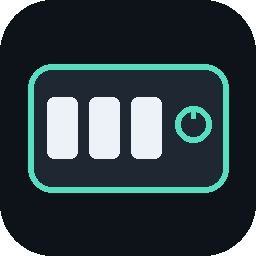
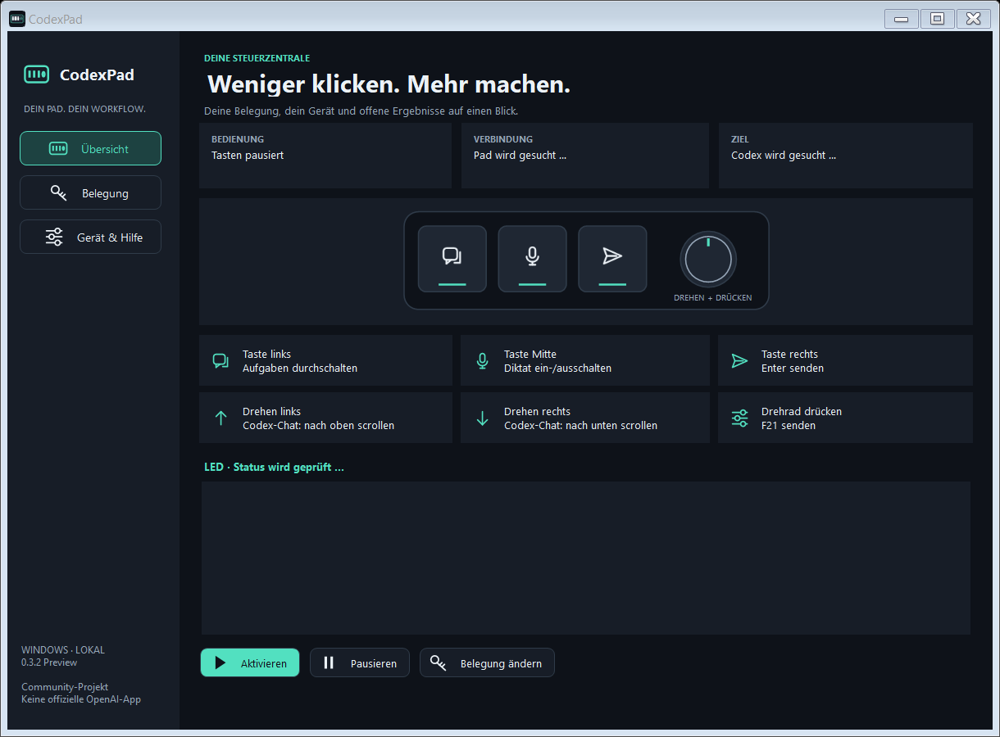

# CodexPad



**Ein kleines Pad. Dein eigener Workflow.**

CodexPad verbindet ein USB-Macropad mit Codex/Work auf Windows: Aufgaben wechseln, diktieren, Nachrichten senden, scrollen und eigene Tastenkürzel auslösen. Die App läuft lokal im Hintergrund.

**0.3.0 Preview · Windows x64 · MIT**

Ein unabhängiges Community-Projekt. Nicht von OpenAI entwickelt oder unterstützt; kein Ersatz für die offizielle Codex-Micro-Hardware.



## Funktionen

- **Alle sechs Eingaben belegen:** drei Tasten, beide Drehrichtungen und Drehrad drücken.
- **Eigene Tastenkürzel aufnehmen:** für Codex/Work oder das aktive Programm.
- **Aufgaben durchschalten:** zuerst fertige ungelesene, dann laufende Aufgaben; zuletzt verwendete als Ersatz.
- **Diktat umschalten:** direkt über „Diktieren“ und „Diktat beenden“ im Nachrichtenfeld.
- **Zwei Scrollvarianten:** normales Mausrad oder gezielt im Codex-Chat, ohne den Zeiger zu verschieben.
- **LED-Ergebnisanzeige:** eingebauter Effekt, solange fertige Ergebnisse ungelesen sind.
- **Hintergrundbetrieb:** X versteckt die App. Erneutes Starten zeigt dieselbe Instanz.
- **Sichern und übertragen:** Einstellungen importieren/exportieren; Sicherung vor jeder Übernahme.

## Loslegen

1. Das Windows-ZIP vollständig in einen beschreibbaren Ordner entpacken, z. B. unter Dokumente. Nicht direkt im ZIP starten.
2. `CodexPad.exe` öffnen. Python und .NET sind im Paket enthalten. Es ist kein zusätzlicher Treiber nötig.
3. Codex/Work öffnen und das Pad anschließen.
4. Bei einem **neuen kompatiblen Pad** unter **Gerät & Hilfe → Pad einrichten** die Hinweise lesen. Das überschreibt die sechs Hardwarebelegungen mit F13–F18. Die Software kann vorherige Hardwarebelegungen nicht auslesen oder sichern.
5. **Eingaben testen**, anschließend **Belegung → Übernehmen** und auf der Übersicht **Aktivieren**.

Autostart, automatische Aktivierung und LED-Kopplung sind bei einer neuen Installation zunächst ausgeschaltet. Du entscheidest selbst, welche Funktionen aktiv werden.

## Unterstützte Hardware

Getestet mit einem SinLoon-Pad mit **drei Tasten und einem drückbaren Drehregler**, USB-Kennung **1189:8890**. Die Konfigurationsschnittstelle wird zusätzlich auf MI_01, Usage Page FF00, Usage 1 und 65-Byte-Berichte mit Report-ID 3 geprüft.

Gleiche Produktbilder oder USB-Kennungen garantieren nicht bei jedem Nachbau die gleiche Firmware. Andere Modelle und ARM64 sind nicht getestet. Bei einer gestörten Dock-Verbindung das Pad direkt am PC prüfen.

## Belegung verstehen

| Bedienung | Standardaktion |
|---|---|
| Taste links | Wichtige Aufgaben durchschalten |
| Taste Mitte | Diktat ein-/ausschalten |
| Taste rechts | Enter senden |
| Drehen links | Im Codex-Chat nach oben scrollen |
| Drehen rechts | Im Codex-Chat nach unten scrollen |
| Drehrad drücken | F21 an Codex senden – dort frei zuweisbar |

**F13–F18 sind die eingehenden Signale vom Pad.** Diese gehören normalerweise nicht geändert. Du findest sie bei Bedarf im aufklappbaren Bereich „Empfangene Pad-Tasten · Erweitert“. Die Aktion ist das, was CodexPad anschließend ausführt.

Unter **Belegung** eine Aktion auswählen oder **Kürzel** anklicken, die Kombination drücken und loslassen. Erst **Übernehmen** aktiviert den Entwurf. **Verwerfen** stellt die aktive Belegung wieder her. **Test** führt die Entwurfsaktion tatsächlich aus; bei „Aktuelles Programm“ bleiben drei Sekunden zum Fensterwechsel.

„Enter senden“ verhält sich wie Enter am aktuell fokussierten Element in Codex. „Nachricht sicher absenden“ ist eine separate Aktion mit Prüfung des Nachrichtenfeldes.

## Aufgaben und LEDs

Die Aufgabenrunde bleibt während des Durchschaltens stabil. Nach zehn Sekunden ohne Tastendruck wird sie neu aufgebaut. Archivierte Aufgaben und interne Unteragenten bleiben ausgeschlossen. Eingabefreigaben werden derzeit nicht zuverlässig erkannt und nicht geraten.

Die LED signalisiert, dass mindestens eine erfasste lokale Aufgabe fertig und ungelesen ist. Sie geht aus, wenn alle betreffenden Ergebnisse gelesen wurden – auch beim Öffnen per Maus. Der Status wird ungefähr alle drei Sekunden geprüft. Bei anhaltend unbekannten Daten wird nach 15 Sekunden abgeschaltet.

Unter **Belegung → Benachrichtigungseffekt** kann Modus 1 oder 2 ausgewählt und mit **Übernehmen** gespeichert werden. Bestehende Einstellungen verwenden weiterhin Modus 1. Unter **Gerät & Hilfe** lassen sich beide Modi jeweils zehn Sekunden testen.

- **Modus 0:** LEDs aus; wird automatisch nach dem Lesen verwendet.
- **Modus 1:** tastenabhängiger Farbeffekt mit anschließendem Abdunkeln.
- **Modus 2:** LEDs leuchten nacheinander.

Es werden ausschließlich eingebaute Firmwareeffekte verwendet. Einzelne LED-Farben sind nicht frei steuerbar. Im laufenden Betrieb wird kein separater Flash-Speicherbefehl gesendet.

## Grenzen der Preview

- Windows 11 x64 ist getestet. Die Oberfläche ist derzeit deutsch.
- Die lokale Aufgabenquelle verwendet interne Codex-Dateien, keine garantierte öffentliche API. Änderungen durch Codex-Updates können Anpassungen erfordern.
- Erfasst werden lokale Benutzeraufgaben der Desktop-Installation. Remote-/Cloud-Aufgaben und mehrere Konten sind nicht vollständig unterstützt.
- Diktat und gezieltes Scrollen hängen von der erkennbaren Codex-Oberfläche ab. Bei uneindeutigen Bereichen wird abgebrochen. Die Erkennung der Diktat-Knöpfe setzt deren deutsche Beschriftung voraus.
- Windows kann Fokuswechsel oder Eingaben in Anwendungen mit höheren Berechtigungen blockieren.
- Die EXE ist nicht codesigniert. Es wird kein Treiber installiert. Das Startpaket enthält die benötigten Laufzeiten.

## Datenschutz

CodexPad hat keinen Server, kein Konto, keine Telemetrie und keinen API-Schlüssel. Die Laufzeit lädt keine Daten aus dem Internet. Der Build lädt bei Bedarf .NET-Pakete und die offizielle Python-Laufzeit.

Aufgabenprotokolle und Lesestatus werden lokal gelesen. Die Oberfläche zeigt Aufgabentitel, Kennungen und Status. Nachrichteninhalte werden nicht in die Diagnoseprotokolle kopiert. Einstellungen und Betriebsprotokolle liegen im entpackten Ordner. **Zum Weitergeben das unveränderte Release-ZIP verwenden, nicht den später persönlich genutzten Ordner.**

## Selbst bauen

Voraussetzungen: Windows x64, .NET SDK 10 und PowerShell 7. Python wird für Tests benötigt; das Release-Paket verwendet eine festgelegte portable Python-Version.

```powershell
./build.ps1
./package.ps1
```

`build.ps1` erzeugt die Anwendung unter `artifacts/app`, ohne eine laufende Installation zu überschreiben. `package.ps1` erstellt unter `dist` ein Windows-ZIP und ein separates Quellcode-ZIP. Der Export folgt einer festen Dateiliste; lokale Einstellungen, Protokolle, Backups und persönliche Dokumente werden nicht übernommen. Der Python-Download ist per SHA-256 festgelegt.

Tests:

```powershell
python -m unittest test_pad_protocol test_pad_status test_pad_backend
./artifacts/app/CodexPad.exe --logic-test
```

## Mitwirken

Siehe [CONTRIBUTING.md](CONTRIBUTING.md) und [SECURITY.md](SECURITY.md). Fehlerberichte bitte ohne persönliche Einstellungen, Chatprotokolle oder vollständige Codex-Datenbanken. Eine knappe Fehlerbeschreibung, Programmversion, Windows-Version und das Pad-Modell reichen meist zum Start.

## Lizenz und Danksagung

Eigener Anwendungscode und Symbole: [MIT](LICENSE). Mitgelieferte Laufzeiten behalten ihre eigenen Lizenzen; siehe [THIRD-PARTY-NOTICES.md](THIRD-PARTY-NOTICES.md).

Die Hardwareimplementierung orientiert sich an öffentlich dokumentierten Protokollen, insbesondere [fleximus/macro_keyboard](https://github.com/fleximus/macro_keyboard/blob/main/protocol.v) und [x0f5c3/ch57x-keyboard-tool](https://github.com/x0f5c3/ch57x-keyboard-tool/blob/master/src/keyboard/k8890.rs). Diese Projekte sind keine mitgelieferten Abhängigkeiten.
